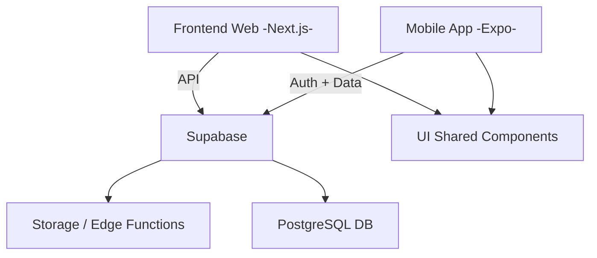

# 🧠 Repaso App

<!-- [](https://github.com/emmanuel128/repaso-app/actions) -->

Plataforma educativa para repasar y prepararse para exámenes profesionales. Inicialmente enfocada en la **Revalida de Psicología (PR)**, construida como arquitectura **whitelabel** para otros exámenes (Maestros, Abogados, College Board, etc.).

---

## 🚀 Tech Stack

| Área | Tecnología |
|------|-------------|
| Web | Next.js 16 + React 19 + Tailwind CSS v4 |
| Mobile | Expo / React Native (planeado, aún no implementado) |
| Backend | Supabase (Postgres, Auth, Storage, Edge Functions) |
| Lenguaje | TypeScript |
| Monorepo | npm Workspaces |

---

## 🧩 Estructura del Proyecto (Monorepo)

Estado actual del monorepo.

```bash
repaso-app/
│
├── infra/
│   └── database/                  # 🗄️ Backend (migraciones, seeds y Edge Functions)
│       ├── package.json
│       └── supabase/
│           ├── migrations/
│           │   └── 20251026_init.sql
│           ├── seeds/
│           │   └── seed.sql
│           └── functions/
│               ├── auth-webhook/
│               └── hello/
│
├── apps/                          # 🌐📱 Frontends
│   ├── web/                       # Next.js app
│   │   ├── next.config.ts
│   │   ├── package.json
│   │   ├── agent.md
│   │   └── src/
│   │       ├── app/
│   │       ├── components/
│   │       ├── lib/
│   │       └── proxy.ts
│   │
│   └── mobile/                    # Placeholder para futura app Expo
│       ├── .gitkeep
│       └── agent.md
│
├── packages/                      # 🧩 Código compartido
│   ├── db/
│   ├── sdk/
│   └── ui/
│
├── .github/
│   └── instructions/
│       └── copilot-instructions.md
│
├── docs/
│   ├── data-model.md
│   └── project-context.md
│
├── package.json
└── README.md
```

## Diagrama

## ⚙️ Configuración e Instalación

1️⃣ Clonar el repositorio
```bash
git clone https://github.com/emmanuel128/repaso-app.git
cd repaso-app
```

2️⃣ Instalar dependencias
```bash
npm install
```

3️⃣ Configurar variables de entorno
Copiar `.env.example` a `.env` y completar valores reales de Supabase.

4️⃣ Variables públicas cliente
- Web (Next.js): prefijo `NEXT_PUBLIC_`
- Mobile (Expo): prefijo `EXPO_PUBLIC_`

5️⃣ Ejecutar la app web
```bash
npm run dev:web
```

6️⃣ Ejecutar la app móvil
```bash
npm run dev:mobile
```

Nota: `apps/mobile` todavía no tiene implementación ni `package.json`, así que este comando no funcionará hasta que se cree el scaffold móvil.

7️⃣ Instancia local de Supabase (opcional)
```bash
npm run db:start
npm run db:migrate
npm run db:reset
npm run db:stop
```

---

## 🧱 Funcionalidades Clave (Visión)

- 🧠 **Preguntas de práctica** tipo examen con resultados instantáneos  
- 📈 **Seguimiento de progreso por tema y por intento**  
- 🎓 **Casos clínicos, notas y mnemotecnias**  
- 👥 **Roles de usuario** (estudiante, instructor, admin)  
- 💳 **Membresías y pagos** (Stripe/PayPal-ready)  
- 🌐 **Modo whitelabel:** configurable por examen y marca  

---

## 🧰 Scripts Root

| Comando | Acción |
|---------|--------|
| `npm run dev:web` | Dev server Next.js |
| `npm run dev:mobile` | Reservado para futura app móvil |
| `npm run dev:all` | Ejecuta todos los `dev` disponibles por workspace |
| `npm run build:all` | Build de workspaces con script `build` |
| `npm run lint:all` | Lint de workspaces con script `lint` |
| `npm run typecheck` | Typecheck de workspaces con script `typecheck` |
| `npm run db:start` | Inicia Supabase local |
| `npm run db:migrate` | Aplica migraciones locales |
| `npm run db:reset` | Resetea DB local y reaplica seeds |
| `npm run db:stop` | Detiene Supabase local |

---

## 🧑‍💻 Contribuir

1. Crear rama: `git checkout -b feature/nueva-funcionalidad`
2. Commit: `feat(area): descripción breve`
3. Push: `git push origin feature/nueva-funcionalidad`
4. PR

Convenciones:
- Commits: `tipo(scope): mensaje` (feat | fix | chore | docs | test | refactor)
- Branches: `feature/`, `fix/`, `chore/`

---

## 🔐 Seguridad & Buenas Prácticas

- No exponer `SERVICE_ROLE_KEY` en cliente (web/mobile).
- La autorización depende de Supabase Auth, JWT claims y RLS en las tablas de aplicación.
- Reutilizar lógica en paquetes compartidos para evitar duplicación.
- Todo contenido para la Revalida en español y terminología consistente.
